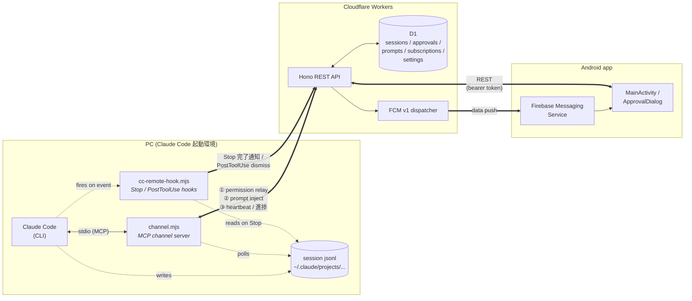
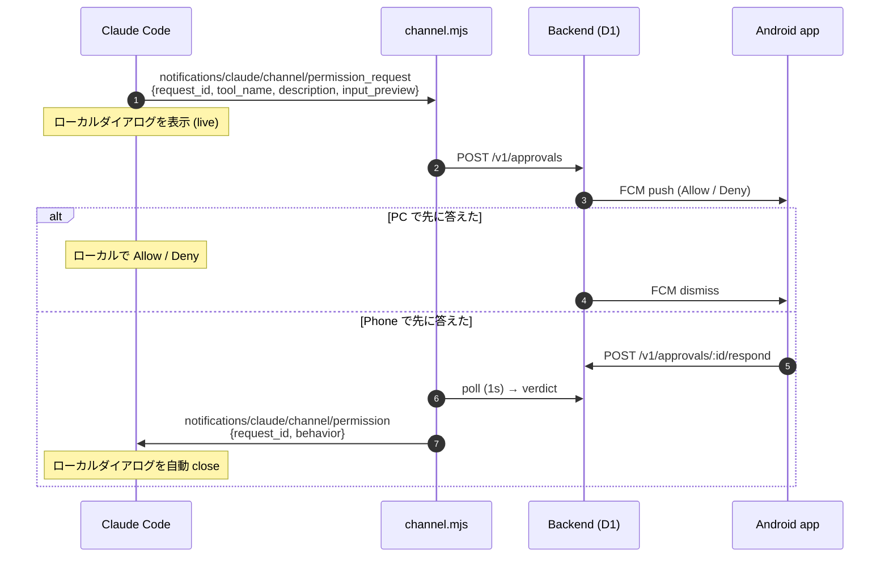

# claude-code-remote

Claude Code を複数セッション並行運用するときの通知・遠隔操作基盤。Android アプリ + Cloudflare Workers backend + Claude Code Channels (permission relay) の3層構成。

## アーキテクチャ

PC で動く Claude Code に **MCP の channel server** を 1 本ぶら下げて、Cloudflare Workers backend を経由してスマホと双方向に喋らせる。3 層構成。



**channel server (`channel/channel.mjs`) が担当する 3 つの flow**:

| | 方向 | 中身 |
|---|---|---|
| **① Permission relay** | CC ↔ phone | `notifications/claude/channel/permission_request` を受けて backend に POST → FCM push → スマホで Allow/Deny → poll で verdict 取得 → `notifications/claude/channel/permission` で返す |
| **② Prompt inject** | phone → CC | スマホが backend に積んだ prompt を 2s 周期で drain → `notifications/claude/channel` で CC のコンテキストに `<channel>` タグとして流し込む |
| **③ Heartbeat / 進捗** | CC → phone | 1.5〜5s 周期で transcript jsonl を読んで `current_prompt` / `current_assistant_text` を backend に upsert。スマホは backend を読んでリアルタイム表示 |

①② は Channels protocol 標準。③ は標準じゃなく channel server プロセスの中で勝手にやってるオマケ。

**hooks は別系統**。tool 実行後の dismiss と、ターン終了時の完了通知 push を担当 (`hooks/cc-remote-hook.mjs`)。channel server とは独立。

### 承認フロー (permission relay)

PC のローカルダイアログとスマホの通知が **同時に live** で、先に答えた方が勝つ (Channels protocol 組み込み):



「常に許可」を選ぶと `add_to_allowlist=true` で返り、channel.mjs が tool パターンを `<cwd>/.claude/settings.local.json` に追記する (Bash / WebFetch のみ)。

## 起動

```bash
claude --dangerously-load-development-channels server:cc-remote
```

エイリアス推奨:

```bash
alias claudec='claude --dangerously-load-development-channels server:cc-remote'
```

`--dangerously-load-development-channels` は Channels research preview の機能で、approved allowlist に載るまで必要。Pro/Max ユーザは claude.ai login + v2.1.81+ で使える。

## 設定ファイル

- **`~/.claude.json`** — `mcpServers` に `cc-remote` 登録（channel server 起動）
- **`~/.claude/hooks/.env`** — Backend URL + shared secret (chmod 600)
- **`~/.claude/settings.json`** — Stop / PostToolUse hooks

## ディレクトリ

| Path | 用途 |
|---|---|
| `channel/` | MCP channel server (Node.js, permission relay) |
| `backend/` | Cloudflare Workers + Hono + D1 + FCM v1 |
| `android/` | Kotlin + Jetpack Compose アプリ |
| `hooks/` | Stop / PostToolUse 用の hook script |
| `docs/` | 設計ノート、セッションログ |

## 主要設計

- 言語: Android = Kotlin + Compose / Backend = TypeScript + Hono
- ストレージ: Cloudflare D1
- 通知: FCM v1 (Web Crypto で RS256 JWT 署名)
- 認証: 共有 bearer token 1種類
- Permission relay: Claude Code Channels (research preview)

詳細は `docs/handover.md` および `docs/sessions/` 参照。
