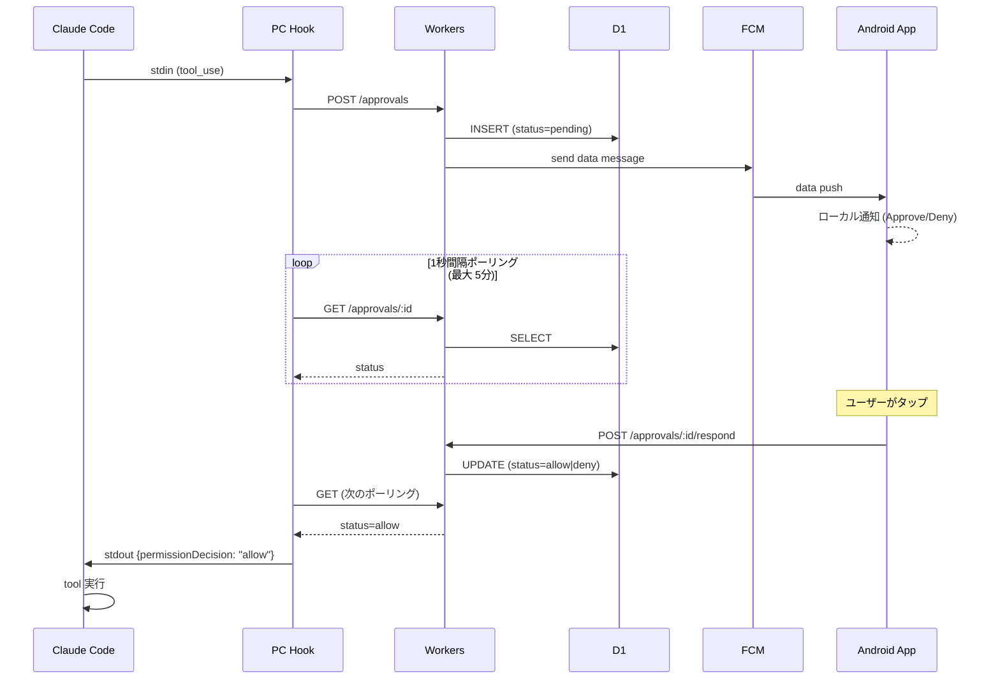
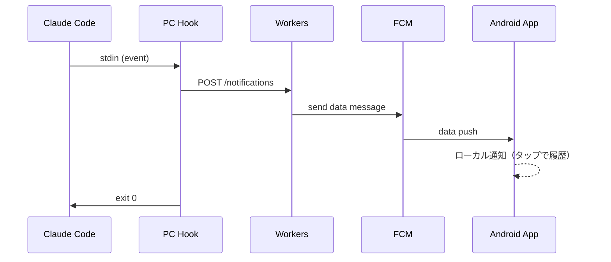

# 引き継ぎ — claude-code-remote

このプロジェクトの現状と設計を 1 ファイルで把握するための文書。実装着手前にまずこれを読む。

## 1. 目的

- VS Code のターミナルタブで Claude Code を複数並行運用しているとき、入力待ち / 権限承認待ち / 処理完了 に気づきたい
- 自分の Android（+ Fitbit ミラー通知）に通知を届け、できれば承認や追加指示まで遠隔で完結させる
- iOS は対象外（Android のみ）
- **個人利用、商用配布なし、public repo として GitHub 公開**

## 2. 現状 (2026-05-04)

- ntfy.sh 経由の通知は Android + Fitbit で動作確認済み
- アプリ・バックエンド・hook はすべて未実装（本セッションで設計確定）
- 設計監査の詳細は [`sessions/2026-05-04_実装方針確定.md`](./sessions/2026-05-04_実装方針確定.md)

## 3. アーキテクチャ

```
┌──────────────────────────────┐
│ PC (macOS) — Claude Code     │
│   hooks → cc-remote-hook.js  │
└────────────┬─────────────────┘
             │  HTTPS (bearer token)
             ▼
┌──────────────────────────────┐
│ Cloudflare Workers (Hono)    │
│   - 承認待ち管理              │
│   - FCM v1 push 中継         │
│   ┌──────────────────────┐   │
│   │ D1 (SQLite at edge)  │   │
│   └──────────────────────┘   │
└────────────┬─────────────────┘
             │  FCM v1 API (RS256 JWT)
             ▼
┌──────────────────────────────┐
│ Android App (Kotlin/Compose) │
│   - 通知受信 / Approve・Deny  │
│   - 履歴・ダッシュボード画面   │
└──────────────────────────────┘
```

### 各コンポーネントの責務

**PC hook script (`cc-remote-hook.js`)**
- Claude Code の PreToolUse / Stop / Notification 等の hook から起動される Node スクリプト
- stdin から hook イベント JSON を受け、Workers backend に POST
- PreToolUse のときだけ backend をポーリングし、stdout に decision JSON を返す
- 配置: `~/.claude/hooks/cc-remote-hook.js`、登録は `~/.claude/settings.json`

**Workers backend (Hono)**
- 単一 Worker、エンドポイント数本
- D1 で承認状態を管理、FCM で push を投げ、応答を受けて状態を更新
- Workers は完全 stateless、D1 が source of truth

**D1 (SQLite at edge)**
- 承認リクエスト・デバイス登録・通知履歴の永続化
- Sequential Consistency（"read your own writes"）

**Android アプリ (Kotlin + Compose)**
- FCM の data push を受けてローカル通知を組み立て、Approve/Deny アクションボタン付きで表示
- アクション → BroadcastReceiver → backend POST、アプリ起動なしで完結
- 履歴・セッション一覧画面（Phase 2）

## 4. 承認フロー（PreToolUse hook）



**タイムアウト時の挙動**: hook 内蔵ポーリングタイムアウト（5分）で応答が得られなければ、`{permissionDecision: "ask"}` を返して Claude Code の通常承認プロンプトに戻す。電波なし・スマホ放置でも詰まらない。

**Claude Code 側の hook タイムアウト**: コマンド型 hook のデフォルト 600 秒のうち、内側で 300 秒運用にして余裕を残す。

## 5. 通知フロー（承認なし — Stop / Notification hook）



承認不要なので fire-and-forget。ポーリングなし。

## 6. データモデル (D1)

```sql
CREATE TABLE devices (
  id           TEXT PRIMARY KEY,         -- アプリ生成 UUID
  fcm_token    TEXT NOT NULL,
  name         TEXT,                     -- "Pixel 9" 等
  registered_at INTEGER NOT NULL         -- epoch sec
);

CREATE TABLE approvals (
  id            TEXT PRIMARY KEY,        -- request UUID
  session_id    TEXT NOT NULL,           -- Claude Code session_id
  cwd           TEXT NOT NULL,
  project_name  TEXT NOT NULL,           -- basename(cwd)
  tool_name     TEXT NOT NULL,
  tool_input    TEXT NOT NULL,           -- JSON 文字列
  status        TEXT NOT NULL CHECK(status IN ('pending','allow','deny','ask','expired')),
  reason        TEXT,
  created_at    INTEGER NOT NULL,
  resolved_at   INTEGER,
  resolved_by   TEXT                     -- devices.id
);
CREATE INDEX idx_approvals_status ON approvals(status, created_at);

CREATE TABLE notifications (
  id            TEXT PRIMARY KEY,
  session_id    TEXT NOT NULL,
  cwd           TEXT NOT NULL,
  project_name  TEXT NOT NULL,
  kind          TEXT NOT NULL,           -- 'completed' | 'waiting' | 'milestone'
  title         TEXT NOT NULL,
  body          TEXT,
  created_at    INTEGER NOT NULL
);
```

古い行は cleanup-on-write（INSERT 時に N 日以上前を DELETE）で対処、cron 不要。

## 7. 認証・秘匿情報（public repo 前提）

すべて HTTPS。認証は **共有秘密 bearer token** 1 種類のみ。

- 32 bytes 暗号学的ランダム文字列を 1 度だけ生成
- 同一値を 3 箇所に配置:
  - PC hook: `~/.claude/hooks/.env`（`SHARED_SECRET=...`）
  - Android アプリ: 初回起動時にユーザーが手動入力 or QR、Android Keystore に保管
  - Workers backend: `wrangler secret put SHARED_SECRET`
- 全 HTTP リクエストの `Authorization: Bearer <secret>` で検証

**FCM service account JSON**:
- GCP プロジェクトで発行 → JSON ダウンロード
- `wrangler secret put FCM_SERVICE_ACCOUNT_JSON`
- Workers が Web Crypto で RS256 JWT 署名 → access_token 取得 → FCM v1 呼び出し

**コミットしないもの**: shared secret、FCM service account JSON、Workers URL、登録済み FCM token

**コミットしてよいもの**: コード一式、`wrangler.toml`（secret 名のみ参照）、`.env.example`、README のセットアップ手順

## 8. Hook 登録例（`~/.claude/settings.json`）

```json
{
  "hooks": {
    "PreToolUse": [{
      "matcher": "Bash|Edit|Write|MultiEdit|mcp__.*",
      "hooks": [{
        "type": "command",
        "command": "node ~/.claude/hooks/cc-remote-hook.js pretool",
        "timeout": 360
      }]
    }],
    "Stop": [{
      "hooks": [{
        "type": "command",
        "command": "node ~/.claude/hooks/cc-remote-hook.js stop"
      }]
    }],
    "Notification": [{
      "hooks": [{
        "type": "command",
        "command": "node ~/.claude/hooks/cc-remote-hook.js notify"
      }]
    }]
  }
}
```

`matcher` で承認対象を絞ることで通知過多を避ける（Read 等の安全 tool は対象外）。Claude Code 側のタイムアウト 360 秒、hook 内ポーリング 300 秒で hook 側が先に `ask` を返す設計。

## 9. ロードマップ

### Phase 0: ベースライン（数日）
- [ ] Cloudflare Workers + D1 + Hono の最小骨組み（health endpoint のみ）
- [ ] FCM プロジェクト作成、service account JSON 取得
- [ ] Android スケルトンアプリ作成、FCM トークン取得・表示

### Phase 1: MVP（Approve/Deny まで、1〜2 週間）
- [x] Workers: `/approvals`, `/notifications`, `/devices` エンドポイント実装
- [x] Workers: FCM v1 呼び出し（Web Crypto JWT 署名）
- [x] PC hook script: PreToolUse のポーリング、Stop / Notification の fire-and-forget
- [x] backend ↔ hook エンドツーエンド動作確認（curl で承認フロー疑似）
- [ ] Android: data push 受信 → ローカル通知 + action button
- [ ] Android: action ボタン → BroadcastReceiver → backend POST
- [ ] フル E2E（Android 含む）動作確認

### Phase 2: 履歴・ダッシュボード
- [ ] Android アプリのメイン画面（履歴、フィルタ、セッション別表示）
- [ ] Agent SDK の `list_sessions()` 連携検討（PC 側）

### Phase 3+: future work
- 詳細は [`widget-plan.md`](./widget-plan.md)
- 公式 Channels の進捗を見て追加プロンプト送信を追加検討

## 10. UI / ブランディング方針

- アプリアイコン・配色は Claude Code 公式マスコット **Clawd**（タコ／カニ的なピクセルアート）を意識した独自イラスト
- Anthropic 知財は商用利用しない範囲で類似させるに留め、公式素材そのものはコミットしない
- ピクセルアート + ターミナル感のあるトーンで Claude Code 公式感を出す

## 11. 参考

### 公式
- [Claude Code hooks](https://code.claude.com/docs/en/hooks)
- [Claude Code Channels](https://code.claude.com/docs/en/channels)
- [Cloudflare Workers Pricing](https://developers.cloudflare.com/workers/platform/pricing/)
- [Cloudflare D1](https://developers.cloudflare.com/d1/)
- [FCM v1 API](https://firebase.google.com/docs/cloud-messaging/migrate-v1)

### OSS 参考実装
- [yuuichieguchi/claude-remote-approver](https://github.com/yuuichieguchi/claude-remote-approver) — 設計参考、JS 2,500 行
- [JessyTsui/Claude-Code-Remote](https://github.com/JessyTsui/Claude-Code-Remote) — Telegram/Email/LINE
- [chronologos/cc-sessions](https://github.com/chronologos/cc-sessions) — Rust、セッション一覧

## 12. オープンクエスチョン

- [ ] Cloudflare 既存利用量と本プロジェクト消費量の合算が無料枠内か（ダッシュボード確認）
- [ ] Android アプリの正式名称・パッケージ ID
- [ ] PC ↔ アプリのペアリング UX（手動入力 / QR / その他）
