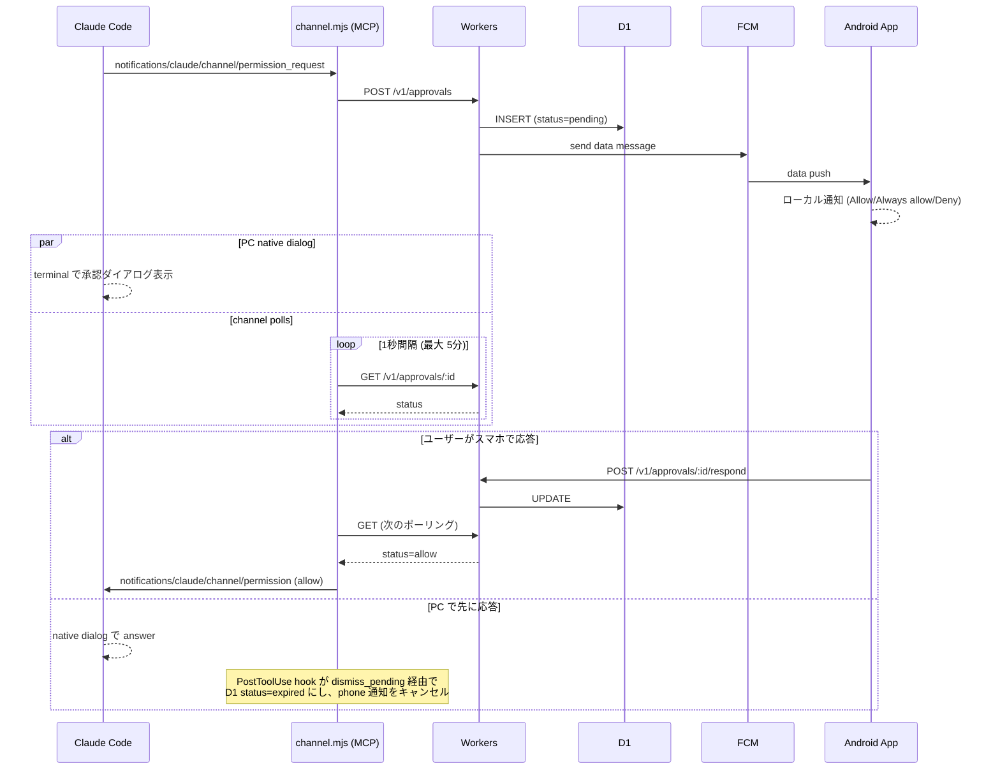
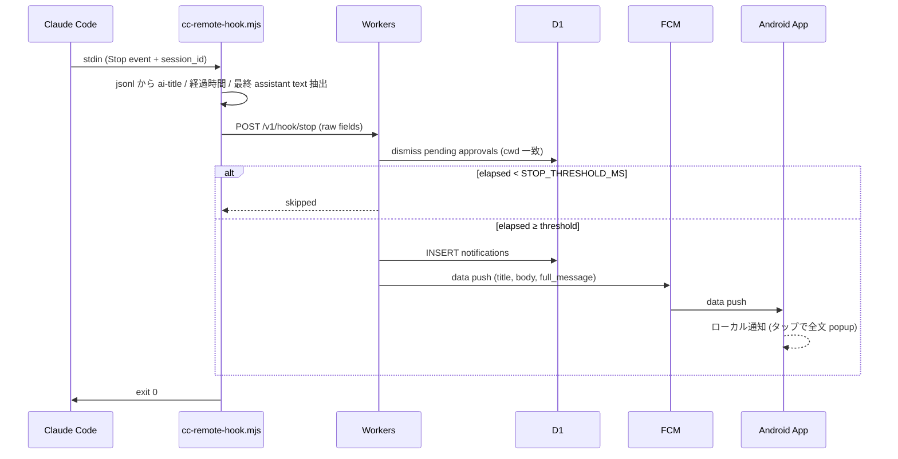

# 引き継ぎ — claude-code-remote

このプロジェクトの現状と設計を 1 ファイルで把握するための文書。実装着手前にまずこれを読む。

## 1. 目的

- VS Code のターミナルタブで Claude Code を複数並行運用しているとき、入力待ち / 権限承認待ち / 処理完了 に気づきたい
- 自分の Android（+ Fitbit ミラー通知）に通知を届け、できれば承認や追加指示まで遠隔で完結させる
- iOS は対象外（Android のみ）
- **個人利用、商用配布なし、public repo として GitHub 公開**

## 2. 現状 (2026-05-18)

- MVP + **双方向操作** + **AskUserQuestion remote** まで完了。承認 / 質問 / 完了通知の受信、inline approve / answer、スマホからの prompt 送信、in-flight assistant text の live 表示、通知 tap で詳細画面遷移までエンドツーエンドで動く
- バックエンド: Cloudflare Workers + Hono + D1 + FCM v1 にデプロイ済み (`claude-code-remote.<subdomain>.workers.dev`)
- Android アプリ: Kotlin + Compose + Material 3。ホーム = セッション一覧（state dot + pull-to-refresh + 凡例）、タップで詳細画面（チャットストリーム + inline approve / answer カード + prompt 入力バー、コピー可能、in-flight pulse）。popup ダイアログは廃止
- PC 側: hooks (Stop / PostToolUse / **PermissionRequest=AskUserQuestion**) と MCP channel server (`channel/channel.mjs`)。channel が approval relay + heartbeat (ping 5〜15s、D1 書き込みは backend 側で変化検知 + throttle、2026-08-25 参照) + queued prompt drain、 専用 hook `hooks/ask-user-question.mjs` が AskUserQuestion を long-poll で per-call relay
- 承認は **Claude Code Channels の permission relay**、質問は **PermissionRequest hook の `updatedInput.answers`** 経路 (CC が AskUserQuestion を MCP channel に流さない事実が確定したため独立経路、 2026-05-17 spike 参照)、追加 prompt は **Channels inbound `notifications/claude/channel`** を採用
- 設計の経緯: [`sessions/2026-05-04_実装方針確定.md`](./sessions/2026-05-04_実装方針確定.md) (初期方針)、[`sessions/2026-05-05_channels方針確定.md`](./sessions/2026-05-05_channels方針確定.md) (channels 採用)、[`sessions/2026-05-05_全層リファクタ.md`](./sessions/2026-05-05_全層リファクタ.md) (Phase 3.5)、[`sessions/2026-05-14_全体リファクタリング.md`](./sessions/2026-05-14_全体リファクタリング.md) (Phase 4)、[`sessions/2026-05-17_AskUserQuestion-spike検証と設計.md`](./sessions/2026-05-17_AskUserQuestion-spike検証と設計.md) (AskUserQuestion 設計)

## 3. アーキテクチャ

```
┌──────────────────────────────┐
│ PC (macOS) — Claude Code     │
│   hooks → cc-remote-hook.js  │
└────────────┬─────────────────┘
             │  HTTPS (bearer token)
             ▼
┌──────────────────────────────┐
│ Cloudflare Workers (Hono)    │
│   - 承認待ち管理              │
│   - FCM v1 push 中継         │
│   ┌──────────────────────┐   │
│   │ D1 (SQLite at edge)  │   │
│   └──────────────────────┘   │
└────────────┬─────────────────┘
             │  FCM v1 API (RS256 JWT)
             ▼
┌──────────────────────────────┐
│ Android App (Kotlin/Compose) │
│   - 通知受信 / Approve・Deny  │
│   - 履歴・ダッシュボード画面   │
└──────────────────────────────┘
```

### 各コンポーネントの責務

**MCP channel server (`channel/channel.mjs`)**
- Claude Code が stdio で起動する subprocess。3 役割:
  1. **Approval relay**: Channels の `permission_request` を受け取り backend に POST、`/v1/wait` long-poll で verdict を取り `permission` notification を返す。JSONL の tool_result 監視で「PC 早勝ち」 を検知して backend に `/dismiss` (= `pending → expired`)
  2. **Heartbeat (5〜15s 周期、 inflight/idle 切替)**: jsonl から sessionId / ai-title / mtime / 進行中 user prompt / 進行中 blocks (text + tool_use 順序保持) を抽出し `/v1/wait` body に同梱して upsert。subprocess の存在自体が "session alive" のシグナル（CC 終了 → このプロセスも終了 → backend が closed と判定）
  3. **Prompt drain**: `/v1/wait` のイベント駆動で queued prompt を受け取り、`/v1/prompts/:id/delivered` で claim してから `notifications/claude/channel` で CC に inject。claim-then-emit で同 cwd に複数 CC があっても二重配信しない
- 「常に許可」レスポンスを受けたら `<cwd>/.claude/settings.local.json` に tool パターンを atomic に追記
- jsonl の synthetic user エントリ（compact summary、`<command-name>`、`<bash-input>`、`<system-reminder>` 等）はフィルタ。channel 経由 inject は (a) CC が idle 時 = `type:"user"` (`origin.kind:"channel"`) / (b) busy 時 = `type:"attachment"` (`attachment.type:"queued_command"`, `attachment.origin.kind:"channel"`) の 2 形態で書かれるので両方を扱い、`<channel ...>...</channel>` を剥がして実 prompt として扱う
- **AskUserQuestion は扱わない**: CC が AskUserQuestion を MCP channel に流さない (2026-05-17 spike で確定) ので、 質問は `hooks/ask-user-question.mjs` (per-call PermissionRequest hook) が長 poll で扱う
- 起動エイリアス: `claude --dangerously-load-development-channels server:cc-remote`

**PermissionRequest hook (`hooks/ask-user-question.mjs`)**
- matcher: AskUserQuestion 限定 (`~/.claude/settings.json` の `hooks.PermissionRequest`)
- AskUserQuestion 発火時に per-call で起動 → backend `/v1/questions` に POST → `/v1/questions/:id/wait` で long-poll → answers を `hookSpecificOutput.decision.updatedInput.answers` で返す → CC が CLI dialog を自動 close + answers を tool_result に採用
- CLI dialog は hook と並行で開く (spike Phase B で確認)。 「PC 早勝ち」 = PostToolUse hook 経由で session-wide dismiss → row 'expired' → /notify skip → phone 通知出ない
- timeout (default 110s) を超えたら何も返さず exit → CC は CLI dialog の応答のみで進行

**PC hook script (`hooks/cc-remote-hook.mjs`)**
- Stop / PostToolUse 専用の薄い forwarder。stdin から hook イベント、`~/.claude/projects/.../<sid>.jsonl` から ai-title・経過時間・最終 assistant blocks を抽出して backend に POST
- PostToolUse は session_id の `dismissPendingApprovals + dismissPendingQuestionsBySession` を発動 (= PC 早勝ち時の phone UI クリーンアップ)
- 表示整形ロジックは backend 側に集約済（this script ≒ jsonl parser のみ）
- 配置: `~/.claude/hooks/cc-remote-hook.mjs`（symlink でリポジトリを参照）、登録は `~/.claude/settings.json`

**Workers backend (Hono)**
- 単一 Worker。`/v1/devices/register`, `/v1/approvals*`, **`/v1/questions*`**, `/v1/hook/{stop,posttool}`, `/v1/sessions*`, `/v1/sessions/:sid/turns`, `/v1/sessions/:sid/prompts*`, `/v1/prompts/:id/delivered`, `/v1/wait`, `/v1/settings`
- D1 で承認 / 質問 / セッション / ターン履歴 / queued prompt / 設定を管理、FCM v1 (Web Crypto RS256 JWT) で push 配送、`UNREGISTERED` トークンは自動 prune
- Stop の閾値判定 (`stop_threshold_ms`) も backend で。短いターンは push スキップ。`ask_delay_ms` (承認用)、`question_ask_delay_ms` (質問用) は別フィールドで持ち、 phone Settings 画面で個別調整可
- セッション state (`working / idle / awaiting_approval / closed`) は heartbeat age + jsonl mtime + pending approval 数から導出
- Stop hook 受信時に `current_prompt` / `current_blocks` を NULL 化、対応する queued prompt 行は `delivered_at` の grace 15s 経過 + Android 側の text 一致 dedup で消える
- Workers は stateless、D1 が source of truth

**D1 (SQLite at edge)**
- `devices`, `approvals`, `questions`, `notifications`, `sessions`, `turns`, `prompts`, `settings` テーブル
- Sequential Consistency（"read your own writes"）

**Android アプリ (Kotlin + Compose + Material 3)**
- FCM data push 受信 → ローカル通知。承認通知の Allow / Always / Deny アクションは BroadcastReceiver → backend POST でアプリ起動不要
- ホーム画面 = セッション一覧（state dot で working/awaiting/idle/closed を可視化）。30s 周期の background poll + 画面表示時 / pull-to-refresh
- 詳細画面 = チャットストリーム（committed turn → in-flight bubble → queued bubble → pending approval inline カード → 入力バー）。3s 周期の detail poll で in-flight assistant text が live に更新される
- 通知タップは `ACTION_OPEN_SESSION + EXTRA_CWD` で該当 cwd の詳細画面に直接遷移（旧 popup ダイアログは廃止）
- `windowSoftInputMode` は default (pan)、Compose 側で `windowInsetsPadding(systemBars)` のみ。IME 出現時は system pan で window 全体が持ち上がるので最新チャットが隠れない

## 4. 承認フロー（Channels permission relay）

PreToolUse hook ポーリング案は廃止し、Claude Code Channels の公式 permission relay に乗り換えた（経緯: [`sessions/2026-05-05_channels方針確定.md`](./sessions/2026-05-05_channels方針確定.md)）。



**タイムアウト**: channel polling 5 分。応答なしなら polling 終了 (CC native dialog はそのまま)。

**Always allow**: phone 側で「常に許可」を選ぶと `add_to_allowlist=true` で respond される。channel.mjs が tool パターンを `<cwd>/.claude/settings.local.json` に追記（現状 Bash と WebFetch のみ — Edit/Write は CC の matcher が glob ベースで literal path がうまく機能しないため意図的に除外）。

## 5. 完了通知フロー（Stop hook）



PostToolUse hook も `/v1/hook/posttool` にだけ POST してその cwd の pending approval を expire させる（CLI で先に答えた場合のスマホ通知クリーンアップ）。

承認不要なので fire-and-forget、ポーリングなし。閾値未満なら push をスキップして連続短ターンでも煩くない。

## 6. データモデル (D1)

migration は `backend/migrations/` に番号付きで配置（`0001_initial.sql` から `0016_question_ask_delay.sql`）。スキーマの正は migration ファイル群、以下は要約:

- **devices** — `id` (UUID), `fcm_token`, `name`, `registered_at`
- **approvals** — `id`, `session_id`, `cwd`, `project_name`, `tool_name`, `tool_input` (JSON: description/input_preview/supports_always), `status` ∈ `pending/allow/deny/expired`, `add_to_allowlist`, `session_label`, `created_at`, `resolved_at`, `resolved_by`
- **questions** — `id`, `session_id`, `cwd`, `project_name`, `session_label`, `questions` (JSON: AskQuestion[]), `status` ∈ `pending/resolved/expired`, `answers` (JSON: `{question: label | label[]}`), `resolved_by`, `created_at`, `notified_at`, `resolved_at`。AskUserQuestion 用、`tool_input` blob が承認と全く違うので別テーブル化 (2026-05-17 設計判断)
- **notifications** — completed push の履歴 (`kind='completed'` 等)
- **sessions** — `session_id` (PK), `cwd`, `project_name`, `ai_title`, `jsonl_mtime`, `last_heartbeat`, `current_prompt`, `current_blocks` (JSON: ordered text + tool_use blocks)。channel.mjs heartbeat で upsert、Stop hook で in-flight 列をクリア
- **turns** — `id`, `cwd`, `session_id`, `user_prompt`, `blocks` (JSON: 順序保持 text + tool_use)、`tool_summary` (JSON), `elapsed_ms`, `ended_at`。Stop hook 時に commit、`(session_id, ended_at DESC)` index、30 日 retention
- **prompts** — `id`, `session_id`, `text`, `status` ∈ `queued/delivered`, `created_at`, `delivered_at`。スマホ → backend → channel.mjs drain → CC inject の queue
- **settings** — 1 行固定 (id=1)、`ask_delay_ms` (承認用 default 10s)、`question_ask_delay_ms` (質問用 default 30s)、`stop_threshold_ms`、`updated_at`。phone Settings 画面で個別調整可

古い行は cleanup-on-write（INSERT/READ 時に N 日以上前を DELETE）で対処、cron 不要。

## 7. 認証・秘匿情報（public repo 前提）

すべて HTTPS。認証は **共有秘密 bearer token** 1 種類のみ。

- 32 bytes 暗号学的ランダム文字列を 1 度だけ生成
- 同一値を 3 箇所に配置:
  - PC hook: `~/.claude/hooks/.env`（`SHARED_SECRET=...`）
  - Android アプリ: 初回起動時にユーザーが手動入力 or QR、Android Keystore に保管
  - Workers backend: `wrangler secret put SHARED_SECRET`
- 全 HTTP リクエストの `Authorization: Bearer <secret>` で検証

**FCM service account JSON**:
- GCP プロジェクトで発行 → JSON ダウンロード
- `wrangler secret put FCM_SERVICE_ACCOUNT_JSON`
- Workers が Web Crypto で RS256 JWT 署名 → access_token 取得 → FCM v1 呼び出し

**コミットしないもの**: shared secret、FCM service account JSON、Workers URL、登録済み FCM token

**コミットしてよいもの**: コード一式、`wrangler.toml`（secret 名のみ参照）、`.env.example`、README のセットアップ手順

## 8. Hook 登録例（`~/.claude/settings.json`）

承認は Channels permission relay (channel.mjs) が、 質問は PermissionRequest hook (ask-user-question.mjs) が担当。PreToolUse は使わない (= 廃止)。

```json
{
  "hooks": {
    "Stop": [{
      "hooks": [{
        "type": "command",
        "command": "node ~/.claude/hooks/cc-remote-hook.mjs stop",
        "timeout": 10
      }]
    }],
    "PostToolUse": [{
      "hooks": [{
        "type": "command",
        "command": "node ~/.claude/hooks/cc-remote-hook.mjs posttool",
        "timeout": 5
      }]
    }],
    "PermissionRequest": [{
      "matcher": "AskUserQuestion",
      "hooks": [{
        "type": "command",
        "command": "node ~/.claude/hooks/ask-user-question.mjs",
        "timeout": 120
      }]
    }]
  }
}
```

加えて `~/.claude.json` の `mcpServers` に channel server を登録:

```json
{
  "mcpServers": {
    "cc-remote": {
      "command": "node",
      "args": ["<repo>/channel/channel.mjs"]
    }
  }
}
```

`~/.claude/hooks/` に repo の hook script を symlink:

```bash
ln -s <repo>/hooks/cc-remote-hook.mjs ~/.claude/hooks/cc-remote-hook.mjs
ln -s <repo>/hooks/ask-user-question.mjs ~/.claude/hooks/ask-user-question.mjs
```

起動は `claude --dangerously-load-development-channels server:cc-remote`（Pro/Max + v2.1.81+ で利用可）。

## 9. ロードマップ

### Phase 0: ベースライン（数日）
- [ ] Cloudflare Workers + D1 + Hono の最小骨組み（health endpoint のみ）
- [ ] FCM プロジェクト作成、service account JSON 取得
- [ ] Android スケルトンアプリ作成、FCM トークン取得・表示

### Phase 1: MVP（Approve/Deny + 完了通知）✅ 完了
- [x] Workers: `/v1/devices/register`, `/v1/approvals*`, `/v1/hook/{stop,posttool}` 実装
- [x] Workers: FCM v1 呼び出し（Web Crypto JWT 署名）+ stale token 自動 prune
- [x] PC: hook scripts (Stop / PostToolUse) と MCP channel server (Channels permission relay)
- [x] Always allow による `<cwd>/.claude/settings.local.json` への atomic 追記
- [x] Android: Compose + Material 3 + FCM 受信 + Approve/Always-allow/Deny + 完了通知 popup
- [x] Android `local.properties` → `BuildConfig` 自動 bootstrap（Setup 画面スキップ）
- [x] Android 実機 E2E（permission relay + 完了通知 popup）
- [x] 全層コードレビュー pass + bug/security fix 一巡（timing-safe auth, allowBackup=false, dialog 必須応答, etc.）

### Phase 2: 履歴・ダッシュボード ✅ 完了
- [x] Android ホーム = セッション一覧（state dot、awaiting/working/idle/closed）
- [x] セッション詳細画面（チャットストリーム、markdown、ターン履歴 limit=20）
- [x] channel.mjs heartbeat (3s) によるセッション state 派生（new hook 不要）

### Phase 3: 双方向操作 ✅ 完了
- [x] スマホ → CC への prompt 送信 (`prompts` テーブル + channel.mjs drain + `notifications/claude/channel`)
- [x] in-flight assistant text の live 表示（jsonl から partial chunk 抽出 → heartbeat → backend → 詳細画面）
- [x] queued bubble（送信即時表示、in-flight に morph、commit 後 dedup で消える）
- [x] 通知タップで詳細画面に直接遷移（popup ダイアログ廃止）
- [x] 詳細画面の inline 承認カード（Allow / Always / Deny）+ コマンド本文表示
- [x] CC が user 扱いで書く synthetic エントリ（compact summary、slash command echo、bash IO 等）のフィルタ
- [x] IME 出現時は system pan に任せ最新チャットが隠れないレイアウト

### Phase 3.5: 全層リファクタ ✅ 完了 (2026-05-05)
- [x] backend を `routes/{devices,approvals,sessions,hooks,prompts}.ts` に分割、auth は `auth.ts`
- [x] `dismissPendingApprovals` を `UPDATE ... RETURNING` でアトミック化 (TOCTOU race 解消)
- [x] cleanup-on-read を `c.executionCtx.waitUntil(...)` に切り替え GET の HTTP セマンティクスを保つ
- [x] D1 batch で sessions/turns/approvals/prompts の N+1 を解消、`add_to_allowlist` の boolean 正規化
- [x] FCM v1 の token cache に single-flight、INVALID_REGISTRATION/UNREGISTERED の判定を JSON ベース化、token prune の bulk 化
- [x] migration 0007: `approvals.reason` (dead column) 削除、0008: `idx_turns_ended`、0009: `idx_approvals_cwd_status`
- [x] channel.mjs と cc-remote-hook.mjs の jsonl パーサ群 (8 関数) を `hooks/lib/{jsonl,env,cwd}.mjs` に集約。hook 側は `transcript_path` を直接利用
- [x] channel.mjs の `pollAndEmit` に `AbortSignal.timeout`、hook の HTTP error / config 欠損を stderr に明示
- [x] Android: `BackendClient` を `BackendClientHolder` で singleton 化（OkHttp connection pool 再利用）
- [x] Android: `MainViewModel` の MutableStateFlow 9 本を `UiState` data class 1 本に集約、`init { }` 統合
- [x] Android: `Screen` sealed class でナビ管理、`MainActivity` は `by viewModels()` で VM 二重生成を解消
- [x] Android: `MessagingService` / `BroadcastReceiver` の `CoroutineScope` を lifecycle 紐付け
- [x] Android: `NotificationFactory` の info ID を `AtomicInteger`、CATEGORY を `EVENT` に
- [x] Android UX: `HomeScreen` に PullToRefreshBox + 状態凡例 + a11y semantics、`SessionDetailScreen` に SelectionContainer + in-flight pulse + haptic + last_heartbeat タイマー、`ChatMarkdown` に `LinkAnnotation.Url`
- [x] Android security: `SettingsScreen` に `FLAG_SECURE`、`data_extraction_rules.xml` / `backup_rules.xml` を DataStore (`datastore/...preferences_pb`) に修正
- [x] Android build: release を `isMinifyEnabled = true` + ProGuard rules (kotlinx.serialization / Ktor / Firebase / Compose)
- [x] `Manifest tools:targetApi` を 35 に整合、`ConfigStore.flow` で `IOException` を catch

### Phase 4: AskUserQuestion remote ✅ 完了 (2026-05-18)
- [x] Spike 検証で PermissionRequest hook + `updatedInput.answers` 経路の挙動を確定 (CLI dialog と並行、 first responder wins)
- [x] D1 `questions` テーブル + `/v1/questions/*` 専用 route
- [x] `hooks/ask-user-question.mjs` (per-call long-poll PermissionRequest hook)
- [x] Android: `PendingQuestionBlock` を SessionDetailScreen に inline 表示、 `QuestionForm` で radio/checkbox/multiSelect、label tap で選択
- [x] チャット履歴に AskUserQuestion の Q→answer を Bash 等と同じ流儀で inline 表示 (`assistantBlocksAfterFromJsonl` が `tool_result.content` を `_resultText` として注入)
- [x] 質問用 `question_ask_delay_ms` を承認用と別フィールドで保持 (default 30s)、phone Settings 画面で個別調整可
- [x] 詳細: [`sessions/2026-05-17_AskUserQuestion-spike検証と設計.md`](./sessions/2026-05-17_AskUserQuestion-spike検証と設計.md)

### Phase 5+: future work
- 詳細は [`widget-plan.md`](./widget-plan.md)
- ホームウィジェット / Wear OS / Fitbit ミラー強化
- `Block` の sealed hierarchy 化 (現状は単一 data class で `kind` discriminator)
- 旧 (blocks NULL) turn 行の表示 (現状 assistant 部が空表示)

## 10. UI / ブランディング方針

- アプリアイコン・配色は Claude Code 公式マスコット **Clawd**（タコ／カニ的なピクセルアート）を意識した独自イラスト
- Anthropic 知財は商用利用しない範囲で類似させるに留め、公式素材そのものはコミットしない
- ピクセルアート + ターミナル感のあるトーンで Claude Code 公式感を出す

## 11. 参考

### 公式
- [Claude Code hooks](https://code.claude.com/docs/en/hooks)
- [Claude Code Channels](https://code.claude.com/docs/en/channels)
- [Cloudflare Workers Pricing](https://developers.cloudflare.com/workers/platform/pricing/)
- [Cloudflare D1](https://developers.cloudflare.com/d1/)
- [FCM v1 API](https://firebase.google.com/docs/cloud-messaging/migrate-v1)

### OSS 参考実装
- [yuuichieguchi/claude-remote-approver](https://github.com/yuuichieguchi/claude-remote-approver) — 設計参考、JS 2,500 行
- [JessyTsui/Claude-Code-Remote](https://github.com/JessyTsui/Claude-Code-Remote) — Telegram/Email/LINE
- [chronologos/cc-sessions](https://github.com/chronologos/cc-sessions) — Rust、セッション一覧

## 12. オープンクエスチョン

- [ ] Cloudflare 既存利用量と本プロジェクト消費量の合算が無料枠内か（ダッシュボード確認）
- [x] Android アプリの正式名称・パッケージ ID → `cc-remote` / `com.tachibanayu24.ccremote`
- [x] PC ↔ アプリのペアリング UX → `local.properties` を build 時に `BuildConfig` に注入する自動 bootstrap で初回入力不要
- [ ] FCM data payload に shell command/assistant 全文が乗る件の脅威モデル明文化（個人用途では許容、配布する場合は `request_id` 経由 fetch に切り替え）
