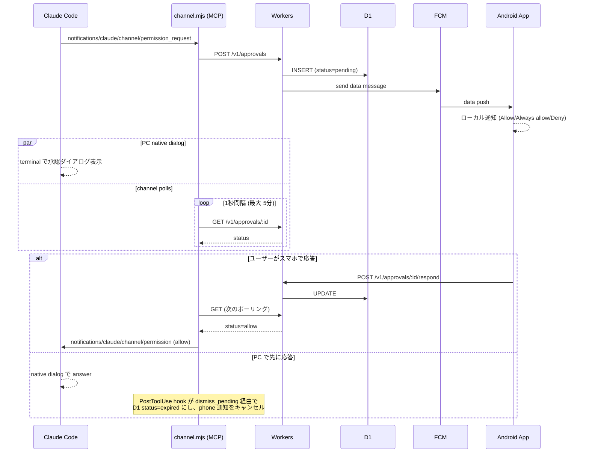
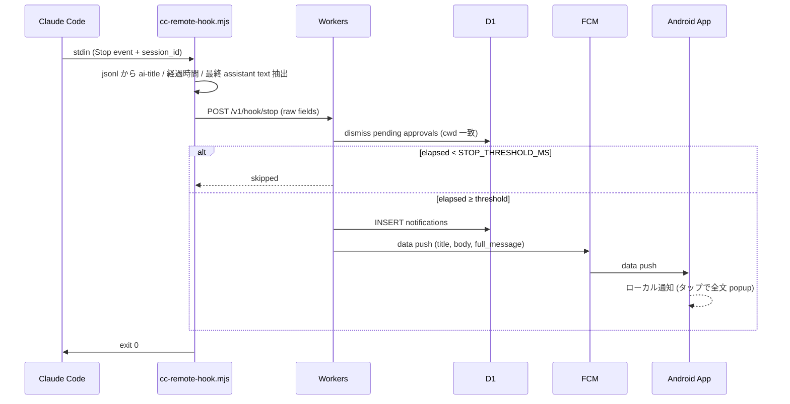

# 引き継ぎ — claude-code-remote

このプロジェクトの現状と設計を 1 ファイルで把握するための文書。実装着手前にまずこれを読む。

## 1. 目的

- VS Code のターミナルタブで Claude Code を複数並行運用しているとき、入力待ち / 権限承認待ち / 処理完了 に気づきたい
- 自分の Android（+ Fitbit ミラー通知）に通知を届け、できれば承認や追加指示まで遠隔で完結させる
- iOS は対象外（Android のみ）
- **個人利用、商用配布なし、public repo として GitHub 公開**

## 2. 現状 (2026-05-05)

- MVP 完了。承認 / 完了通知ともスマホで受け取り→操作までエンドツーエンドで動く
- バックエンド: Cloudflare Workers + Hono + D1 + FCM v1 にデプロイ済み (`claude-code-remote.<subdomain>.workers.dev`)
- Android アプリ: Kotlin + Compose + Material 3、FCM data push 受信 + Approve / Always-allow / Deny + 完了通知 popup
- PC 側: hooks (Stop / PostToolUse) と MCP channel server (`channel/channel.mjs`) で permission relay
- 承認は **Claude Code Channels の permission relay** を採用（旧 PreToolUse ポーリング案は廃止）
- 設計の経緯は [`sessions/2026-05-04_実装方針確定.md`](./sessions/2026-05-04_実装方針確定.md) と [`sessions/2026-05-05_channels方針確定.md`](./sessions/2026-05-05_channels方針確定.md)

## 3. アーキテクチャ

```
┌──────────────────────────────┐
│ PC (macOS) — Claude Code     │
│   hooks → cc-remote-hook.js  │
└────────────┬─────────────────┘
             │  HTTPS (bearer token)
             ▼
┌──────────────────────────────┐
│ Cloudflare Workers (Hono)    │
│   - 承認待ち管理              │
│   - FCM v1 push 中継         │
│   ┌──────────────────────┐   │
│   │ D1 (SQLite at edge)  │   │
│   └──────────────────────┘   │
└────────────┬─────────────────┘
             │  FCM v1 API (RS256 JWT)
             ▼
┌──────────────────────────────┐
│ Android App (Kotlin/Compose) │
│   - 通知受信 / Approve・Deny  │
│   - 履歴・ダッシュボード画面   │
└──────────────────────────────┘
```

### 各コンポーネントの責務

**MCP channel server (`channel/channel.mjs`)**
- Claude Code が stdio で起動する subprocess。Channels の `permission_request` を受け取り backend に POST、approval id でポーリングし `permission` notification を返す
- 「常に許可」レスポンスを受けたら `<cwd>/.claude/settings.local.json` に tool パターンを atomic に追記
- 起動エイリアス: `claude --dangerously-load-development-channels server:cc-remote`

**PC hook script (`hooks/cc-remote-hook.mjs`)**
- Stop / PostToolUse 専用の薄い forwarder。stdin から hook イベント、`~/.claude/projects/.../<sid>.jsonl` から ai-title・経過時間・最終 assistant text を抽出して backend に POST
- 表示整形ロジックは backend 側に集約済（this script ≒ jsonl parser のみ）
- 配置: `~/.claude/hooks/cc-remote-hook.mjs`（symlink でリポジトリを参照）、登録は `~/.claude/settings.json`

**Workers backend (Hono)**
- 単一 Worker。`/v1/devices/register`, `/v1/approvals*`, `/v1/hook/{stop,posttool}`
- D1 で承認状態を管理、FCM v1 (Web Crypto RS256 JWT) で push 配送、`UNREGISTERED` トークンは自動 prune
- Stop の閾値判定 (`STOP_THRESHOLD_MS`) も backend で。短いターンは push スキップ
- Workers は stateless、D1 が source of truth

**D1 (SQLite at edge)**
- `devices`, `approvals`, `notifications` テーブル
- Sequential Consistency（"read your own writes"）

**Android アプリ (Kotlin + Compose + Material 3)**
- FCM data push を受けてローカル通知を組み立て、Approve / Always allow / Deny / 完了通知 popup を表示
- アクション → BroadcastReceiver → backend POST、アプリ起動なしで完結
- 履歴・セッション一覧画面（Phase 2）

## 4. 承認フロー（Channels permission relay）

PreToolUse hook ポーリング案は廃止し、Claude Code Channels の公式 permission relay に乗り換えた（経緯: [`sessions/2026-05-05_channels方針確定.md`](./sessions/2026-05-05_channels方針確定.md)）。



**タイムアウト**: channel polling 5 分。応答なしなら polling 終了 (CC native dialog はそのまま)。

**Always allow**: phone 側で「常に許可」を選ぶと `add_to_allowlist=true` で respond される。channel.mjs が tool パターンを `<cwd>/.claude/settings.local.json` に追記（現状 Bash と WebFetch のみ — Edit/Write は CC の matcher が glob ベースで literal path がうまく機能しないため意図的に除外）。

## 5. 完了通知フロー（Stop hook）



PostToolUse hook も `/v1/hook/posttool` にだけ POST してその cwd の pending approval を expire させる（CLI で先に答えた場合のスマホ通知クリーンアップ）。

承認不要なので fire-and-forget、ポーリングなし。閾値未満なら push をスキップして連続短ターンでも煩くない。

## 6. データモデル (D1)

```sql
CREATE TABLE devices (
  id           TEXT PRIMARY KEY,         -- アプリ生成 UUID
  fcm_token    TEXT NOT NULL,
  name         TEXT,                     -- "Pixel 9" 等
  registered_at INTEGER NOT NULL         -- epoch sec
);

CREATE TABLE approvals (
  id            TEXT PRIMARY KEY,        -- request UUID
  session_id    TEXT NOT NULL,           -- Claude Code session_id
  cwd           TEXT NOT NULL,
  project_name  TEXT NOT NULL,           -- basename(cwd)
  tool_name     TEXT NOT NULL,
  tool_input    TEXT NOT NULL,           -- JSON 文字列
  status        TEXT NOT NULL CHECK(status IN ('pending','allow','deny','ask','expired')),
  reason        TEXT,
  created_at    INTEGER NOT NULL,
  resolved_at   INTEGER,
  resolved_by   TEXT                     -- devices.id
);
CREATE INDEX idx_approvals_status ON approvals(status, created_at);

CREATE TABLE notifications (
  id            TEXT PRIMARY KEY,
  session_id    TEXT NOT NULL,
  cwd           TEXT NOT NULL,
  project_name  TEXT NOT NULL,
  kind          TEXT NOT NULL,           -- 'completed' | 'waiting' | 'milestone'
  title         TEXT NOT NULL,
  body          TEXT,
  created_at    INTEGER NOT NULL
);
```

古い行は cleanup-on-write（INSERT 時に N 日以上前を DELETE）で対処、cron 不要。

## 7. 認証・秘匿情報（public repo 前提）

すべて HTTPS。認証は **共有秘密 bearer token** 1 種類のみ。

- 32 bytes 暗号学的ランダム文字列を 1 度だけ生成
- 同一値を 3 箇所に配置:
  - PC hook: `~/.claude/hooks/.env`（`SHARED_SECRET=...`）
  - Android アプリ: 初回起動時にユーザーが手動入力 or QR、Android Keystore に保管
  - Workers backend: `wrangler secret put SHARED_SECRET`
- 全 HTTP リクエストの `Authorization: Bearer <secret>` で検証

**FCM service account JSON**:
- GCP プロジェクトで発行 → JSON ダウンロード
- `wrangler secret put FCM_SERVICE_ACCOUNT_JSON`
- Workers が Web Crypto で RS256 JWT 署名 → access_token 取得 → FCM v1 呼び出し

**コミットしないもの**: shared secret、FCM service account JSON、Workers URL、登録済み FCM token

**コミットしてよいもの**: コード一式、`wrangler.toml`（secret 名のみ参照）、`.env.example`、README のセットアップ手順

## 8. Hook 登録例（`~/.claude/settings.json`）

PreToolUse は廃止（Channels permission relay が肩代わり）。Stop と PostToolUse の 2 本だけ。

```json
{
  "hooks": {
    "Stop": [{
      "hooks": [{
        "type": "command",
        "command": "node ~/.claude/hooks/cc-remote-hook.mjs stop",
        "timeout": 10
      }]
    }],
    "PostToolUse": [{
      "hooks": [{
        "type": "command",
        "command": "node ~/.claude/hooks/cc-remote-hook.mjs posttool",
        "timeout": 5
      }]
    }]
  }
}
```

加えて `~/.claude.json` の `mcpServers` に channel server を登録:

```json
{
  "mcpServers": {
    "cc-remote": {
      "command": "node",
      "args": ["<repo>/channel/channel.mjs"]
    }
  }
}
```

起動は `claude --dangerously-load-development-channels server:cc-remote`（Pro/Max + v2.1.81+ で利用可）。

## 9. ロードマップ

### Phase 0: ベースライン（数日）
- [ ] Cloudflare Workers + D1 + Hono の最小骨組み（health endpoint のみ）
- [ ] FCM プロジェクト作成、service account JSON 取得
- [ ] Android スケルトンアプリ作成、FCM トークン取得・表示

### Phase 1: MVP（Approve/Deny + 完了通知）✅ 完了
- [x] Workers: `/v1/devices/register`, `/v1/approvals*`, `/v1/hook/{stop,posttool}` 実装
- [x] Workers: FCM v1 呼び出し（Web Crypto JWT 署名）+ stale token 自動 prune
- [x] PC: hook scripts (Stop / PostToolUse) と MCP channel server (Channels permission relay)
- [x] Always allow による `<cwd>/.claude/settings.local.json` への atomic 追記
- [x] Android: Compose + Material 3 + FCM 受信 + Approve/Always-allow/Deny + 完了通知 popup
- [x] Android `local.properties` → `BuildConfig` 自動 bootstrap（Setup 画面スキップ）
- [x] Android 実機 E2E（permission relay + 完了通知 popup）
- [x] 全層コードレビュー pass + bug/security fix 一巡（timing-safe auth, allowBackup=false, dialog 必須応答, etc.）

### Phase 2: 履歴・ダッシュボード
- [ ] Android アプリのメイン画面（履歴、フィルタ、セッション別表示）
- [ ] Agent SDK の `list_sessions()` 連携検討（PC 側）

### Phase 3+: future work
- 詳細は [`widget-plan.md`](./widget-plan.md)
- Channels の `additional_prompts` 仕様確定後に「phone から PC の CC に追加プロンプト送信」を検討

## 10. UI / ブランディング方針

- アプリアイコン・配色は Claude Code 公式マスコット **Clawd**（タコ／カニ的なピクセルアート）を意識した独自イラスト
- Anthropic 知財は商用利用しない範囲で類似させるに留め、公式素材そのものはコミットしない
- ピクセルアート + ターミナル感のあるトーンで Claude Code 公式感を出す

## 11. 参考

### 公式
- [Claude Code hooks](https://code.claude.com/docs/en/hooks)
- [Claude Code Channels](https://code.claude.com/docs/en/channels)
- [Cloudflare Workers Pricing](https://developers.cloudflare.com/workers/platform/pricing/)
- [Cloudflare D1](https://developers.cloudflare.com/d1/)
- [FCM v1 API](https://firebase.google.com/docs/cloud-messaging/migrate-v1)

### OSS 参考実装
- [yuuichieguchi/claude-remote-approver](https://github.com/yuuichieguchi/claude-remote-approver) — 設計参考、JS 2,500 行
- [JessyTsui/Claude-Code-Remote](https://github.com/JessyTsui/Claude-Code-Remote) — Telegram/Email/LINE
- [chronologos/cc-sessions](https://github.com/chronologos/cc-sessions) — Rust、セッション一覧

## 12. オープンクエスチョン

- [ ] Cloudflare 既存利用量と本プロジェクト消費量の合算が無料枠内か（ダッシュボード確認）
- [x] Android アプリの正式名称・パッケージ ID → `cc-remote` / `com.tachibanayu24.ccremote`
- [x] PC ↔ アプリのペアリング UX → `local.properties` を build 時に `BuildConfig` に注入する自動 bootstrap で初回入力不要
- [ ] FCM data payload に shell command/assistant 全文が乗る件の脅威モデル明文化（個人用途では許容、配布する場合は `request_id` 経由 fetch に切り替え）
